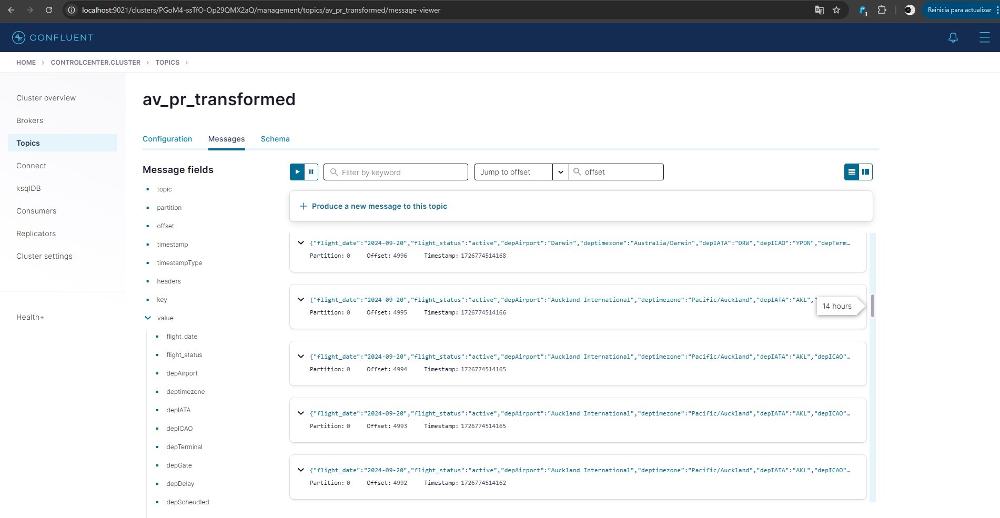
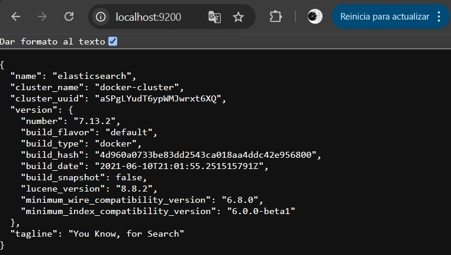
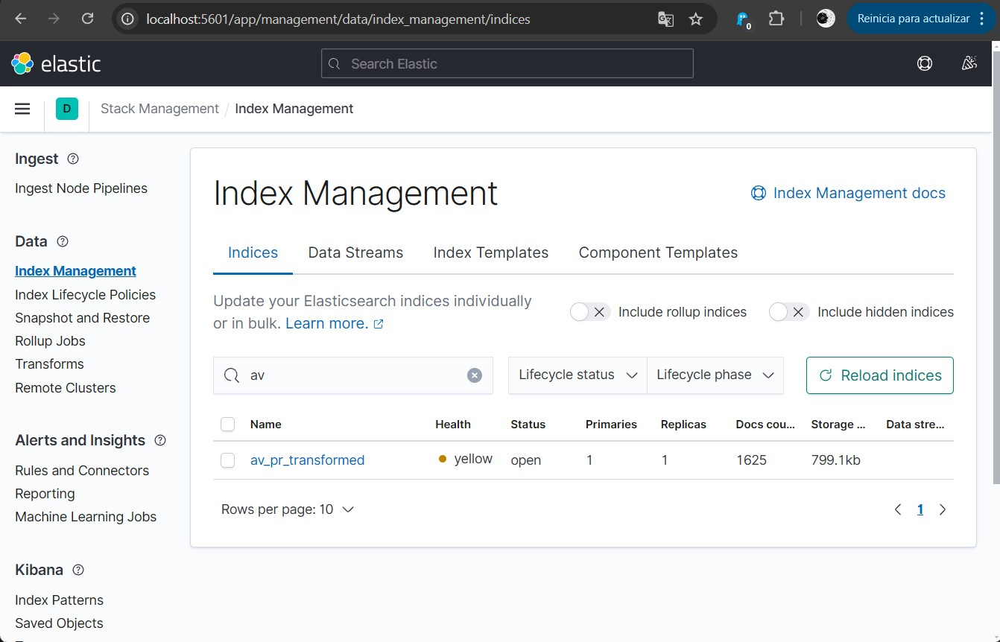
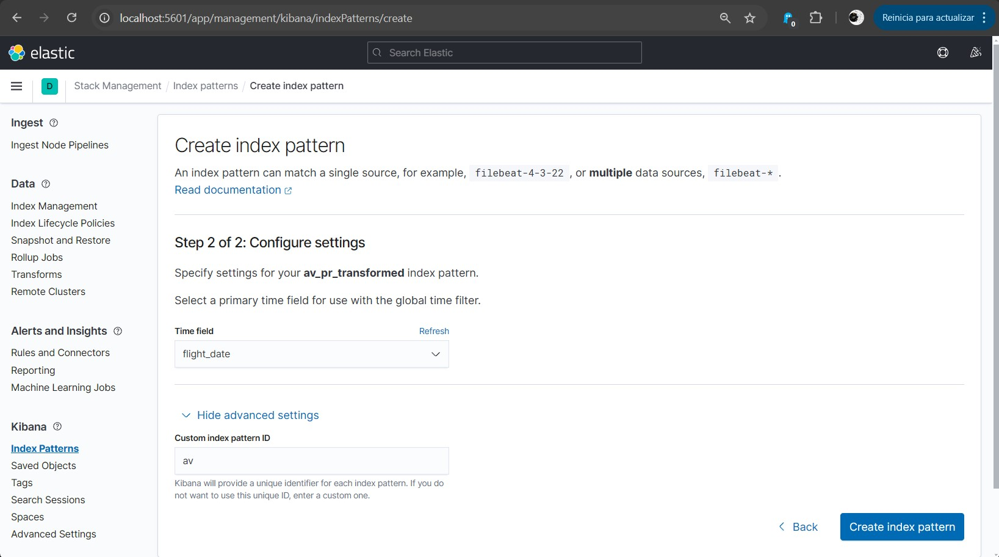
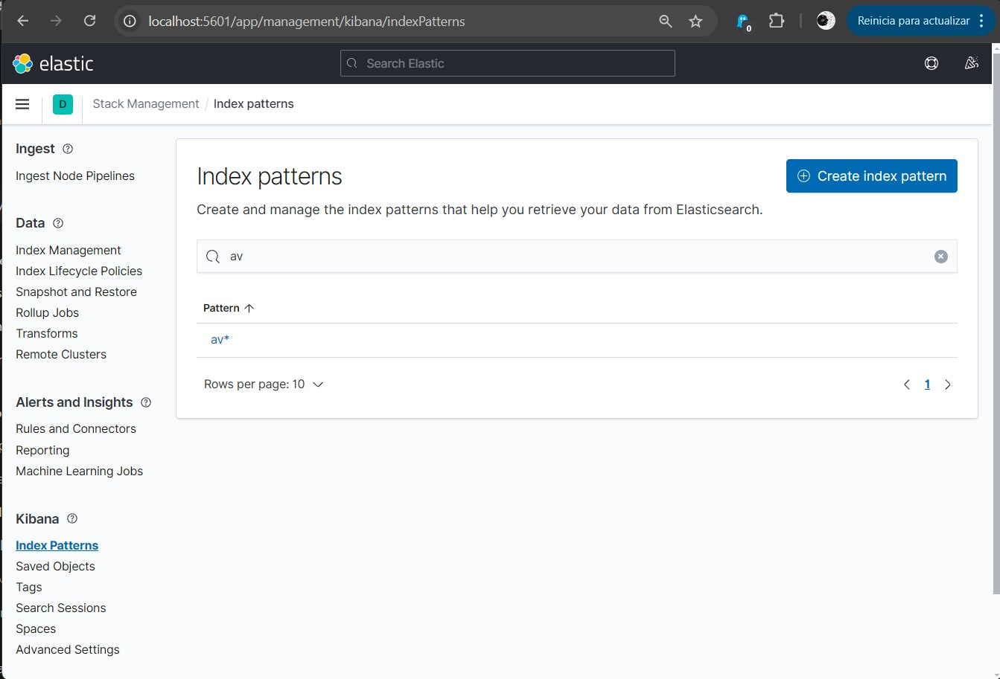
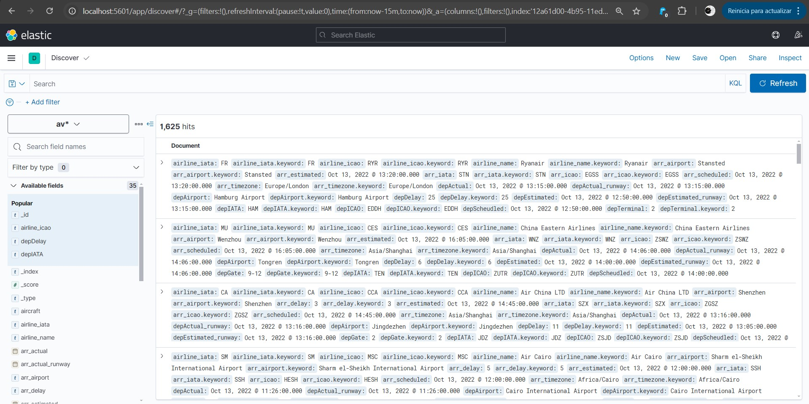
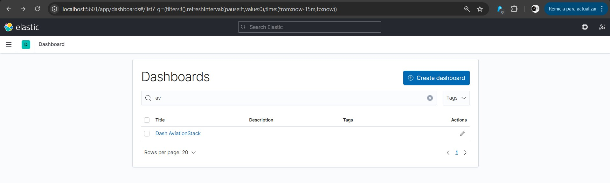
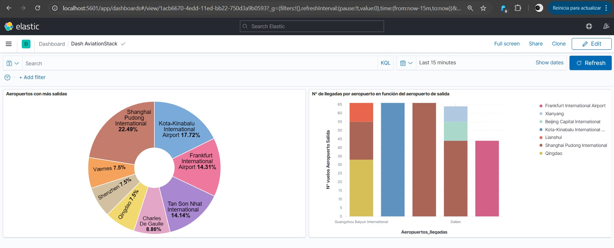

<a name="readme-top"></a>

[![LinkedIn][linkedin-shield]][linkedin-url]


<!-- PROJECT LOGO -->
<br />
<div align="center">
  <a href="https://github.com/Andrescogim/Real-time-transform-visualization">
    
  </a>

<h1 align="center">ETL en Tiempo Real dockerizada: De la Web a Kibana con NiFi, Kafka y Python</h1>
</div>

Este repositorio contiene una **ETL (Extracción, Transformación y Carga)** diseñada para procesar datos en tiempo real, empleando una arquitectura de microservicios contenedorizados con Docker. La ETL comprende todo el proceso desde la recogida de datos de la web en tiempo real, su envío y procesado para finalmente almacenamiento en BBDD y visualización.


<div align="left">
<!-- TABLE OF CONTENTS -->
<details>
  <summary>Table of Contents</summary>
  <ol>
    <li>
      <a href="#arquitectura">Arquitectura</a>
    </li>
    <li>
      <a href="#requisitos-previos">Requisitos Previos</a>
    </li>
    <li>
      <a href="#instalacion">Instalacion</a>
    </li>
    <li>
      <a href="#usage">Usage</a>
      <ul>
        <li><a href="#installation">Installation</a></li>
      </ul>
    </li>
    <li><a href="#contact">Contact</a></li>
  </ol>
</details>
</div>

<!-- GETTING STARTED -->
## Arquitectura

Este proyecto sigue una arquitectura de microservicios donde cada componente está contenedorizado con Docker para facilitar su despliegue y escalabilidad. El flujo de datos en tiempo real sigue los siguientes pasos:

1. **Apache NiFi**: Captura datos en tiempo real desde la web, los transforma y los envía a una cola en Kafka.
2. **Apache Kafka**: Gestiona la transmisión de datos mediante una cola de mensajes que asegura una entrega eficiente y fiable.
3. **Python**: Procesa los datos recibidos desde Kafka realizando operaciones de transformación y limpieza para mandarlos a otro topic de Kafka.
4. **ElasticSearch**: Almacena los datos procesados para su indexación y consulta en tiempo real.
5. **Kibana**: Proporciona una visualización de los datos almacenados en ElasticSearch mediante paneles de control interactivos.

Cada uno de estos servicios es ejecutado en un contenedor Docker independiente, lo que permite una fácil gestión y escalabilidad del sistema.

## Requisitos Previos

Antes de comenzar, asegúrate de contar con las siguientes herramientas instaladas en tu sistema:

- **Docker** y **Docker Compose**
- **Python 3.x**


## Instalación

1. Clona este repositorio en tu máquina local:
   ```bash
   git clone https://github.com/Andrescogim/Real-time-transform-visualization
   ```

2. Navega a la carpeta docker del repositorio y levanta los servicios con Docker Compose a partir del archivo docker-compose.yaml
   ```bash
   cd "local_repo_route"/docker

   docker-compose up
   ```
   Con esto se descargarán los contenedores creados a través de las imágenes para todos los servicios definidos en el archivo docker-compose.yml (NiFi, Kafka, ElasticSearch, Kibana), dejándolos listos para ser levantados. 


## Usage

Con todo instalado ya podemos comenzar a utilizar los servicios.

1. Ejecución del servicio Nifi:
   ```bash
   docker-compose start nifi
   ```
    Este servicio se comunica mediant el puerto 8090. Accedemos al servicio desde un navegador en http://localhost:8090/nifi. Una vez dentro se crea el flujo para la lectura de datos en tiempo real. El módulo básico necesario es un GenerateFlowFile para capturar datos a través de una API. Para esta arquitectura se ha realizado la conexión con Aviationstack.com para lo que se crea otro módulo específico. Además se añaden otros 2 módulos para formatear los datos que vienen en formato JSON y por último se añade un módulo PublishKafka para enviarlo a una cola de Kafka.

<div align="center">
  <a href="https://github.com/Andrescogim/Real-time-transform-visualization">
    
  </a>
</div>

2. Para la ejecución del servicio Apache Kafka. Necesario iniciar 2 contenedores:

    - Zookeeper es un serviciodel ecosistema de Kafka, encargado de coordinar y gestionar los brokers, manteniendo información de configuración, el estado de los clusters y la sincronización entre ellos.

    - El Broker de Kafka es el componente que recibe, almacena y distribuye los mensajes en los tópicos. Los brokers manejan la transmisión de datos y permiten la comunicación entre los productores y consumidores de mensajes.

   ```bash
   docker-compose start zookeeper
   docker-compose start broker
   ```
    
    De esta forma el servicio Apache Kafka esta listo para gestionar los mensajes que vienen de Nifi.

      - 2.1 Para una visualización más cómoda de los clusters y mensajes gestionados por Kafka se puede hacer uso del control center:
        ```bash
        docker-compose start control-center
        ```
        Podemos acceder a través del puerto 9021, en http://localhost:9021/.


3. Ejecutar script kafka-transform.py (en src/kafka-transform.py) para el procesado de los datos crudos provenientes de la API de Aviationstack. Este programa recibe los mensajes de la cola aviones_pr2 (de NiFi), los imprime en pantalla y tras ser procesados se envían a la cola para mensajes procesados: av_pr_transformed. En el control cente rse puede comprobar que el flujo de datos está funcoinando correctamente ya que vemos los mensajes en av_pr_transformed:




4. Ininicar Elasticsearch para almacenar los datos ya procesados y el conector kafka-connect para la comunicación entre Kafka y la BBDD Elasticsearch:
    ```bash
    docker-compose start elasticsearch
    docker-compose start kafka-connect
    ```
Para la conexión con fafka-connect:
  * Entrar al Control Center (http://localhost:9021/)
  * Entrar al cluster donde se encuentran todos los topics.
  * En la sección "Connect" vemos el cluster llamado "connect". Le damos y nos da la opción de añadir un conector. Se añade este conector que enlaza la cola de kafka con los mensajes procesados (av_pr_transformed):  
  {  
    "connector.class": "io.confluent.connect.elasticsearch.´ ElasticsearchSinkConnector",  
    "connection.url": "http://elasticsearch:9200",  
    "tasks.max": "1",  
    "topics": "av_pr_transformed",  
    "name": "Elasticserach Connector Sink",  
    "auto.create.indices.at.start": "true",  
    "type.name": "ticker",  
    "value.converter": "org.apache.kafka.connect.json.JsonConverter",  
    "value.converter.schemas.enable": "false",  
    "schema.ignore": "true",  
    "key.ignore": "true"  
   }

  Se puede comprobar el correcto funcionamiento de Elasticsearch en el puerto 9200. Entrando a http://localhost:9200/ se ve el cluster creado:

<div align="center">
  
</div>

 5. Por último se visualizan los datos en Kibana. Se inicia el contenedor correspondiente, al que se puede acceder a través del puerto 5601 --> http://localhost:5601:
    ```bash
    docker-compose start kibana
    ```
    Una vez en Kibana se comprueba que el índice av_pr_transformed ha sido creado en Management" --> "Stack Management" --> "Data" --> "Index Management".

 

Si no lo encontramos es por fallo de Kafka Connector. Si lo encontramos entonces es necesasrio crear el *Index Pattern* en Kibana donde se indica la estructura de los mensajes que se recibirán. Para ello hay que ir a "Index Patterns" --> "Create index pattern", seleccionar el index ya creado av_pr_transformed y crear el nuevo en Kibana al que llamaremos "av".

 

En "Kibana" --> "Index Patterns" ahora aparece el Index que se acaba de crear.

 

6. En este punto la ETL ya está construída y preparada para funcionar. Se ejecuta el script de python y tras comprobar que todos los servicios funcionan se ejecuta el proyecto NiFi, que comienza a enviar datos en función del intervalo que se le ha asignado. En este caso al ser una API de pago solo se pueden realizar un cierto número de consultas al mes, por lo que el intervalo se pone cada 5 minutos para no gastar los tokens rápidamente.

En Kibana iremos a Home --> "Analytics" --> "Discover" donde se puede ver el Index creado en el apartado anterior. Al seleccionarlo encontramos almacenados todos los mensajes enviados desde NiFi ya procesados:

 

7. Kibana permite la construcción de dashboards interactivos, con los que se puede monitorizar la información en tiempo real. En este proyecto se recoge información sobre todos los vuelos en el mundo como aeropuerto, precio, horas de salida y llegada... por lo que podemos tener una visión de como esta funcionando el tráfico aéreo en cualquier lugar en tiempo real. En "Analytics" --> "Dashboard" --> "Create dashboard" se puede crear un nuevo dashboard o modificar uno creado previamente.

 

Una vez creados podemos visualizarlos y ver como cambian en tiempo real. En este caso se pueden ver 2 gráficos. En el gráfico circular vemos un ranking con los aeropuertos con mayor número de salidas mientras que en el izquierdo se ve un gráfico de barras donde indica el nº de llegadas por aeropuerto en función del aeropuerto de salida.

 


<!-- CONTACT -->
## Contact

Andrés Coronado Giménez - andrescogim@gmail.com

Project Link: [https://github.com/Andrescogim/Real-time-transform-visualization](https://github.com/Andrescogim/Real-time-transform-visualization)

Linkedin: https://www.linkedin.com/in/andres-coronado-gimenez

<p align="right">(<a href="#readme-top">back to top</a>)</p>


<!-- MARKDOWN LINKS & IMAGES -->
[linkedin-url]: https://www.linkedin.com/in/andres-coronado-gimenez/
[linkedin-shield]: https://img.shields.io/badge/-LinkedIn-black.svg?style=for-the-badge&logo=linkedin&colorB=555

